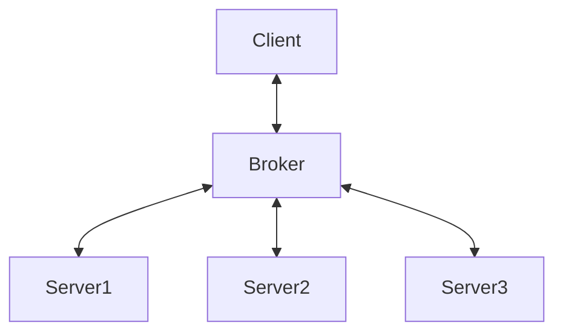

# Broker pattern (브로커 패턴)

- 분리된 컴포넌트들을 구조화 할 때 유용. 
- 브로커는 각 분리된 컴포넌트들의 통신을 담당. 

## Uses
- IPC(inter-process communication)
- [Apche ActiveMQ Message broker](https://en.wikipedia.org/wiki/Apache_ActiveMQ)  
- [Apache Kafka Message broker](https://en.wikipedia.org/wiki/Apache_Kafka)  
- [RabbitMQ Message broker](https://en.wikipedia.org/wiki/RabbitMQ)  
- [JBoss Messaging Message broker](https://en.wikipedia.org/wiki/JBoss_Messaging)  

## Diagram

## Component of broker pattern
- client : service requester
- server : service manager
- broker : service middleman
- bridge (if necessary)
- client-server proxy (if necessary)

`