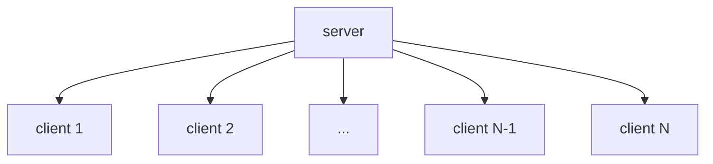

# client-server pattern (클라이언트-서버 패턴)

- 하나의 서버와 다수의 클라이언트로 구성. 
- 서버 컴포넌트는 다수의 클라이언트 컴포넌트로 서비스를 제공.  
- 클라이언트의 요청에 서버는 적절한 서비스를 제공.  
- 서버는 클라이언트의 요청을 대응하기 위해 계속 대기한다.  

## diagram

## Uses

- online application (`e-mail`, `document share`, `bank`, `etc...`).  

