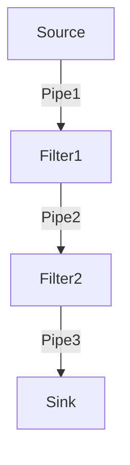

# Pipe-filter pattern (파이프-필터 패턴)

- 데이터 스트림을 생성, 처리하는 시스템에서 사용. 
- 각 처리과정은 filter compoent에서 이루어 지며, 처리되는 데이터는 pipes를 통해 전송. 
- pipes는 buffering or synchronization 목적으로 사용.  



## Uses

- compiler, sequencial한 filter들은 어휘 분석, 파싱, 의미 분석 그리고 코드 생성을 수행. 
- 생물정보학의 워크 플로우 
- bash에서의 shell 명령어 
```bash
ls -al | grep -rn 
```
- 비밀번호 암호화
- web application 신원 검증

