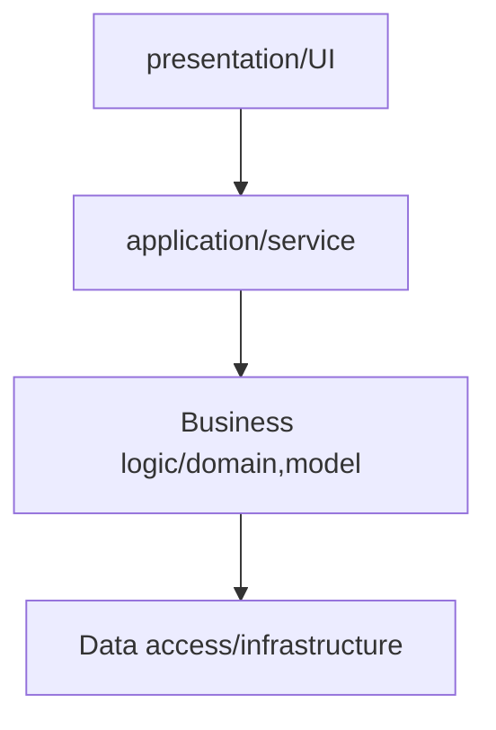

# layered pattern ( 계층화 패턴 )

- 이 패턴은 n-티어 아키텍쳐 패턴이라고 불린다.  
- 하나의 프로그램을 그룹 or 서브 프로그램으로 구조화(계층화)하기 위한 패턴. (각 계층은 추상화 개념을 가진다. )  
- 각 계층은 상위 계층에 서비스를 제공.  
- 일반적으로 `presentation layer`, `application layer`, `business layer`, `persistence layer` 등이 있으며, 각 계층마다 의존도에 따라 연결되어 전체 시스템을 구성.  

## diagram of layer

## explanation of layered pattern 

> - peresntation layer (UI layer)
>> - 클라이언트와 직접적으로 연결되는 부분 -> 웹사이트(UI), backend API -> end point  
>> - `presentation layer`는 API의 엔드포인트를 정의하고 전송된 HTTP 요청을 읽어 들이는 로직을 구현.  

> - Application layer ( Service )
>> - 오직 작업을 조정하고 아래의 도메인 계층에게 작업을 위임.  

> - Business logic layer ( Domain )
>> - 업무 개념 및 업무 상황, 규칙을 표현
>> - 상태 제어

> - Data access layer ( infrastructure / persistence(영속) ) 
>> - 상위 계층을 지원하는 일반화된 기술적 기능 지원.  ( message transfer, db access )  

## Uses 

- PC Desktop application
- e-commerce web application  
