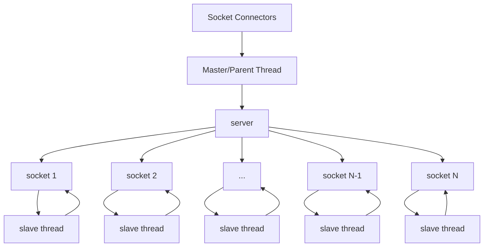

# master-slave pattern (마스터-슬레이브 패턴)

- 마스터와 동등한 역할을 하는 다수의 슬레이브를 가지는 구조. 
- 마스터는 work(1)-slave(n) 구조를 통해 분산 처리를 하여 결과 값을 받고 최종 결과를 계산.   
- work의 분할-정복 알고리즘으로, 정복 결과에 대한 정확성은 요건에 따라 다름.  
- 데이터베이스 복제에서, 마스터 데이터베이스는 신뢰할 수 있는 데이터 소스. 
- 슬레이브 데이터베이스는 마스터 데이터베이스와 동기화. 

## diagram

## Uses
- peripherals of computer system

