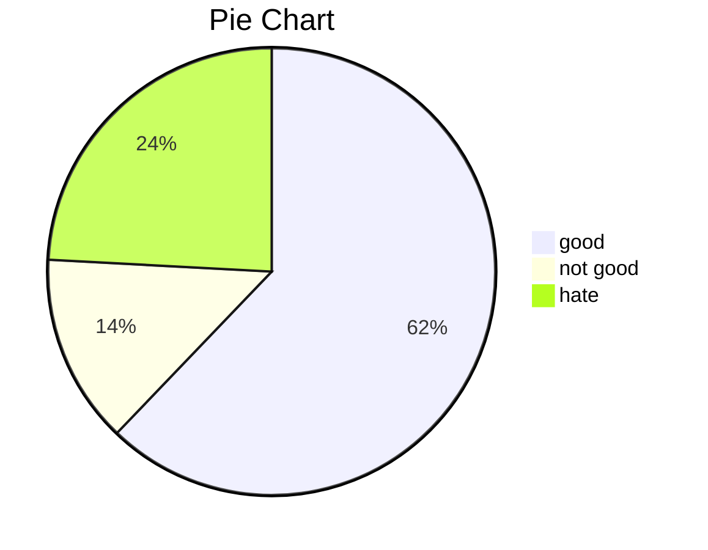

# categorical data experience 

## 1. Frequency Table ( 도수분포표 )

### What is Frequency?
- 각 범주에 속하는 관측값의 개수

### relative frequency? ( 상대도수 )
- 도수를 전체 개수로 나눈 비율 

### frequency table ( 도수분포표 )
- 범주형 자료에서 범주와 그 범주에 대응하는 도수와 상대도수를 나열하여 표를 작성한 것. 

#### example 
- N명중세서 good N - 1, not goot N - 2, hate N - 3, no answer N - 4

| response | frequency | relative frequency(reponse/total number) |
| ---       |   --- |   --- |
| good  | N -1 | N - 1 / N |
| not good | N - 2 | N - 2 / N |
| hate | N - 3 | N - 3 / N |
| no answer | N - 4 | N - 4 / N |

## 2. pie chart ( 원형그래프/ 파이차트 )

