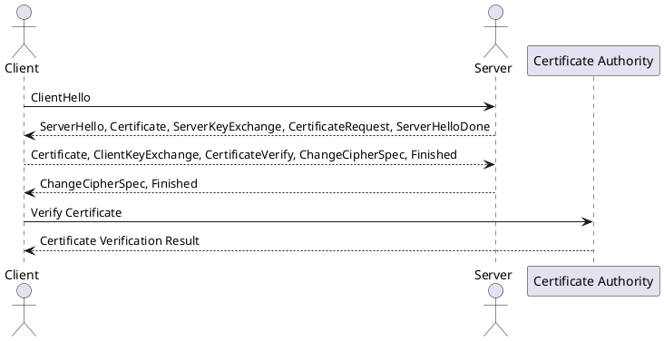

TLS (Transport Layer Security) is a cryptographic protocol that provides secure communication over a network. It ensures the confidentiality, integrity, and authenticity of data transmitted between a client and a server.

To establish a secure connection using TLS, the following steps are typically involved:

1. Handshake: The client and server initiate a TLS handshake to negotiate the encryption algorithms and exchange cryptographic parameters.

2. Certificate Exchange: The server presents its digital certificate, which is issued by a trusted Certificate Authority (CA). The certificate contains the server's public key and other identifying information.

3. Certificate Validation: The client verifies the server's certificate by checking its validity, authenticity, and the CA's trustworthiness. This step ensures that the server is who it claims to be.

4. Key Exchange: The client generates a random session key and encrypts it using the server's public key. The server decrypts the session key using its private key.

5. Secure Communication: Once the session key is exchanged, the client and server use symmetric encryption algorithms to encrypt and decrypt data transmitted between them.

6. Data Transfer: The client and server can now securely exchange data over the established TLS connection. The data is encrypted and protected from eavesdropping or tampering.

PlantUML code to visualize the TLS handshake with a CA certificate:

This diagram illustrates the basic TLS handshake process between a client and a server, including the involvement of a Certificate Authority for certificate verification.
