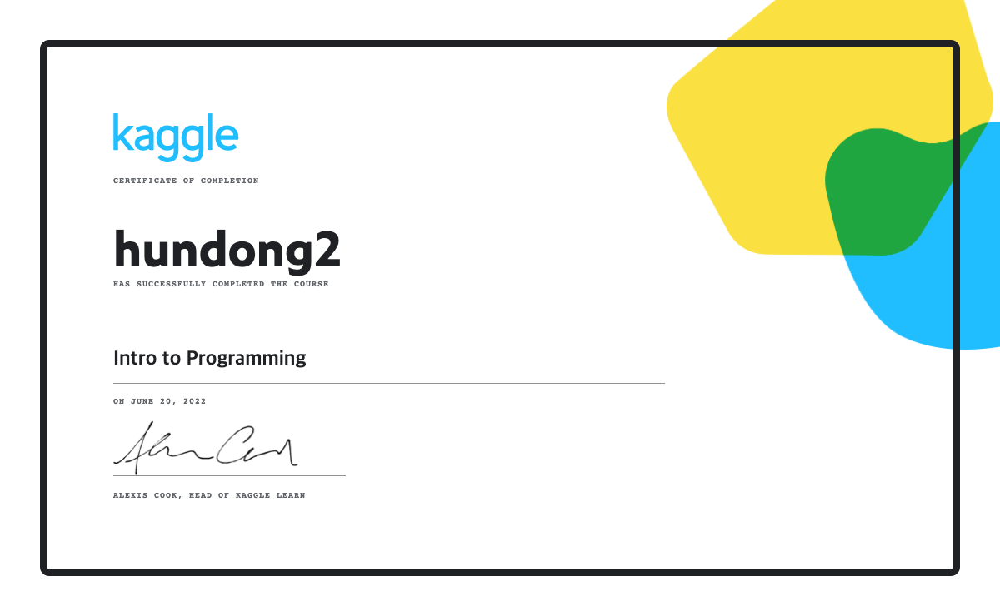
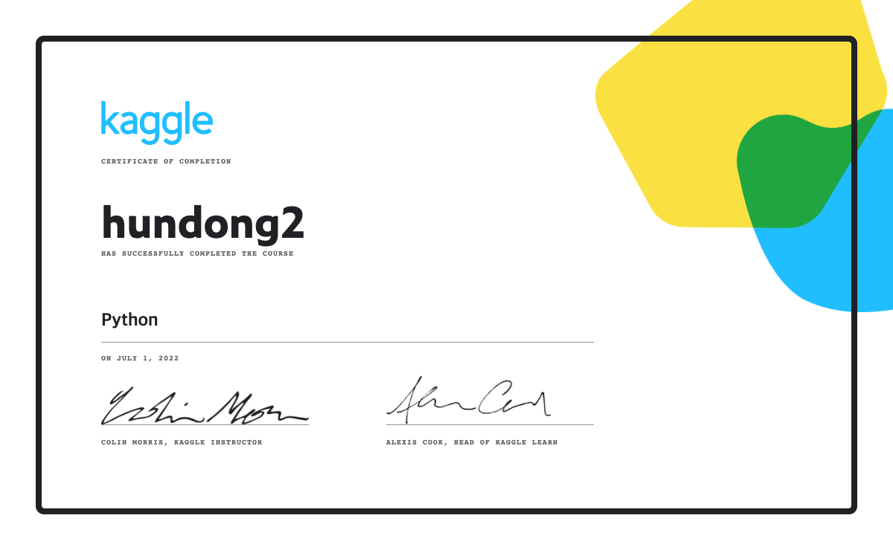
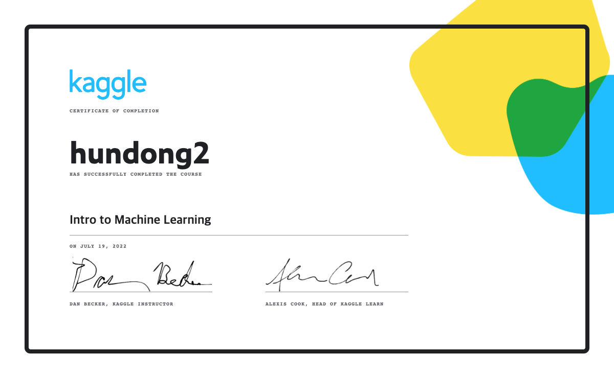

<p align="center">
🇰🇷 hello my name is donghun👐<br>
I'm software engineer<br>
</p>

<a href="https://www.gitanimals.org/">
  
</a>
<a href="https://www.gitanimals.org/en_US?utm_medium=image&utm_source=hundong2&utm_content=farm">
  
</a>

<p align="center">
  <strong>SNS list</strong><br><br>
  <a href="https://physicalkingman.tistory.com/" target="_blank">
    
  </a>
</p>
<p align="center">
  <a href="https://app.daily.dev/systemalee">
    
  </a>
</p>

---

## <p align="center">💗 MY OTHER HALF 💗</p>

<p align="center">
  
</p>

---

## <p align="center">👨‍💻 About Me</p>

<p align="center">
With over <strong>9 years of experience</strong>, I am a versatile engineer specializing in<br>
<strong>Test Automation · CI/CD · Embedded Systems · AI/LLM Applications</strong><br><br>
My journey spans from low-level embedded programming (IoT, RTOS, defense systems)<br>
to high-level AI-driven applications and cloud infrastructure.
</p>

---

## <p align="center">🏢 Work Experience</p>

<table align="center" width="100%">
  <tr>
    <td width="30%" align="right"><strong>Feb 2023 – Present</strong></td>
    <td width="5%" align="center">🔵</td>
    <td width="65%">
      <strong>Senior Research Engineer</strong> @ <a href="https://www.hyundai-autoever.com">Hyundai AutoEver</a><br>
      <sub>CI/CD pipelines · Test Automation · AI Chatbot (Semantic Kernel) · Grafana Dashboard</sub><br>
      <sub><code>C#</code> <code>.NET</code> <code>Python</code> <code>Docker</code> <code>Bamboo</code> <code>Grafana</code> <code>LLM</code></sub>
    </td>
  </tr>
  <tr>
    <td align="right"><strong>Nov 2022 – Jan 2023</strong></td>
    <td align="center">🔵</td>
    <td>
      <strong>Application Developer</strong> @ Altair Engineering<br>
      <sub>PCB Board GUI · Graphical Rendering Performance</sub><br>
      <sub><code>C# WPF</code> <code>OpenGL</code></sub>
    </td>
  </tr>
  <tr>
    <td align="right"><strong>Jun 2020 – Nov 2022</strong></td>
    <td align="center">🔵</td>
    <td>
      <strong>Senior Researcher</strong> @ LIG Nex1<br>
      <sub>Defense DAS · Missile Simulator · Target Coordinate Algorithms</sub><br>
      <sub><code>C++</code> <code>C</code> <code>C# WPF</code> <code>MFC</code> <code>Embedded Linux</code> <code>VxWorks</code></sub>
    </td>
  </tr>
  <tr>
    <td align="right"><strong>Jan 2017 – Jun 2020</strong></td>
    <td align="center">🔵</td>
    <td>
      <strong>Embedded System Engineer</strong> @ Nuritelecom<br>
      <sub>IoT Smart Gateway · LwM2M/DLMS Protocol · Wi-SUN Mesh Network</sub><br>
      <sub><code>C</code> <code>C++</code> <code>Embedded Linux</code> <code>FreeRTOS</code> <code>LwM2M</code> <code>CoAP</code> <code>DTLS/TLS</code></sub>
    </td>
  </tr>
</table>

---

## <p align="center">⚒️ Tech Stack</p>

**🖥️ Languages**

<p align="center">
  
  
  
  
  
  
</p>

**🧩 Frameworks & Libraries**

<p align="center">
  
  
  
  
  
  
</p>

**🖥️ Platforms & OS**

<p align="center">
  
  
  
  
  
  
</p>

**🛠️ Tools & DevOps**

<p align="center">
  
  
  
  
  
  
  
  
  
  
  
  
</p>

**🤖 AI / LLM**

<p align="center">
  
  
  
  
  
  
</p>

**📡 Protocols & Networking**

<p align="center">
  
  
  
  
  
  
</p>

**💡 Concepts & Methodologies**

<p align="center">
  
  
  
  
  
</p>

---

## <p align="center">📦 Repository Navigator</p>

> 총 **153개** 레포지토리를 카테고리별로 정리했습니다. 🔀 는 Fork된 레포입니다.

### 🔍 Quick Jump

| Category | Count |
|---|---|
| [🤖 AI / Machine Learning](#-ai--machine-learning) | 16 |
| [🛠️ Claude Code & AI Tools](#️-claude-code--ai-tools) | 12 |
| [🌐 Web / Frontend](#-web--frontend) | 19 |
| [📱 Mobile / Android](#-mobile--android) | 4 |
| [💻 C# / .NET](#-c--net) | 22 |
| [⚙️ C++ / System](#️-c--system) | 11 |
| [🐍 Python & Data Science](#-python--data-science) | 17 |
| [🔐 Security](#-security) | 4 |
| [🔌 Protocol / Network / Embedded](#-protocol--network--embedded) | 8 |
| [🏗️ DevOps / Infrastructure](#️-devops--infrastructure) | 6 |
| [☕ Java](#-java) | 3 |
| [📚 Study & References](#-study--references) | 31 |

---

<details open>
<summary><h3>🤖 AI / Machine Learning</h3></summary>

| Repository | Description | Lang |
|---|---|---|
| [AI](https://github.com/hundong2/AI) | Agent, LLM, RAG, ADK, MCP, LangChain, A2A, LangGraph 실험 모음 |  |
| [council_lab](https://github.com/hundong2/council_lab) | CrewAI, Council Agent 등 멀티에이전트 실험 | - |
| [Philosophy_hundong2](https://github.com/hundong2/Philosophy_hundong2) | AI 철학 및 개인 원칙 정리 |  |
| [Quantum](https://github.com/hundong2/Quantum) | 양자 컴퓨팅 학습 |  |
| [keras_study](https://github.com/hundong2/keras_study) | Keras 딥러닝 학습 |  |
| 🔀 [moai-adk](https://github.com/hundong2/moai-adk) | MoAI - Agentic Development Kit |  |
| 🔀 [llm-from-scratch](https://github.com/hundong2/llm-from-scratch) | 《밑바닥부터 만들면서 공부하는 LLM》(길벗, 2025) |  |
| 🔀 [machine_learning](https://github.com/hundong2/machine_learning) | 머신러닝 학습 노트 & 실습 |  |
| 🔀 [machine-learning](https://github.com/hundong2/machine-learning) | 머신러닝 입문자 스터디용 저장소 |  |
| 🔀 [crewAI](https://github.com/hundong2/crewAI) | 롤플레이 자율 AI 에이전트 오케스트레이션 프레임워크 |  |
| 🔀 [crewAI-examples](https://github.com/hundong2/crewAI-examples) | CrewAI 워크플로우 자동화 예제 모음 |  |
| 🔀 [essential-mathematics-for-ai](https://github.com/hundong2/essential-mathematics-for-ai) | 《AI를 위한 필수 수학》(한빛미디어) 코드 |  |
| 🔀 [courses_anthropics](https://github.com/hundong2/courses_anthropics) | Anthropic 공식 교육 코스 |  |
| 🔀 [Deep-Learning-Papers-Reading-Roadmap](https://github.com/hundong2/Deep-Learning-Papers-Reading-Roadmap) | 딥러닝 논문 읽기 로드맵 |  |
| 🔀 [dlaicourse](https://github.com/hundong2/dlaicourse) | 딥러닝 학습 노트북 |  |
| 🔀 [data-science-blogs](https://github.com/hundong2/data-science-blogs) | 데이터 사이언스 블로그 큐레이션 |  |

</details>

---

<details open>
<summary><h3>🛠️ Claude Code & AI Tools</h3></summary>

| Repository | Description | Lang |
|---|---|---|
| [awesome-claude-code](https://github.com/hundong2/awesome-claude-code) | Claude Code 학습 & 팁 모음 📚 |  |
| [my-friends-claude](https://github.com/hundong2/my-friends-claude) | Awesome Claude 설정 & 활용 모음 |  |
| [copilot_answer_set](https://github.com/hundong2/copilot_answer_set) | Copilot 응답 데이터셋 수집 |  |
| [mcp-copilot](https://github.com/hundong2/mcp-copilot) | MCP Copilot 도구 |  |
| 🔀 [AionUi](https://github.com/hundong2/AionUi) | 로컬 오픈소스 24/7 Cowork 앱 (Gemini CLI, Claude Code, Codex 지원) |  |
| 🔀 [awesome-agent-skills](https://github.com/hundong2/awesome-agent-skills) | Claude Code Skills + 200개 이상의 에이전트 스킬 컬렉션 | - |
| 🔀 [everything-claude-code-lee](https://github.com/hundong2/everything-claude-code-lee) | Claude Code 완전 설정 모음 (agents, skills, hooks, commands, rules, MCPs) | - |
| 🔀 [claude-code-showcase](https://github.com/hundong2/claude-code-showcase) | Claude Code 프로젝트 설정 예제 (hooks, skills, GitHub Actions 포함) |  |
| 🔀 [openskills](https://github.com/hundong2/openskills) | AI 코딩 에이전트용 유니버설 스킬 로더 (`npm i -g openskills`) |  |
| 🔀 [oh-my-ag](https://github.com/hundong2/oh-my-ag) | Google Antigravity IDE용 PM·Frontend·Backend·QA 전문 에이전트 스킬 |  |
| 🔀 [mdflow](https://github.com/hundong2/mdflow) | 마크다운 프롬프트(.md)를 Claude·Codex·Gemini 등으로 실행하는 멀티백엔드 CLI |  |
| 🔀 [awesome-prompts](https://github.com/hundong2/awesome-prompts) | ChatGPT 최고 평점 프롬프트 & 프롬프트 엔지니어링 모음 | - |

</details>

---

<details>
<summary><h3>🌐 Web / Frontend</h3></summary>

| Repository | Description | Lang |
|---|---|---|
| [hundong2.github.io](https://github.com/hundong2/hundong2.github.io) | GitHub Pages 개인 사이트 |  |
| [Portfolio](https://github.com/hundong2/Portfolio) | 개인 포트폴리오 사이트 |  |
| [MyHairDesigner](https://github.com/hundong2/MyHairDesigner) | 헤어 디자이너 앱 |  |
| [laboratory](https://github.com/hundong2/laboratory) | 웹 실험 및 프로토타이핑 |  |
| [news_letter](https://github.com/hundong2/news_letter) | 뉴스레터 프로젝트 |  |
| [zombie_game](https://github.com/hundong2/zombie_game) | 좀비 게임 |  |
| [english_study](https://github.com/hundong2/english_study) | 영어 학습 앱 |  |
| [web_study](https://github.com/hundong2/web_study) | 웹 스터디 저장소 |  |
| [flaskexample](https://github.com/hundong2/flaskexample) | Flask 예제 |  |
| [Flask-Study](https://github.com/hundong2/Flask-Study) | Flask 학습 | - |
| [techlee](https://github.com/hundong2/techlee) | 소프트웨어 기술 블로그 |  |
| [storyboard](https://github.com/hundong2/storyboard) | 스토리보드 |  |
| [mintlify-docs](https://github.com/hundong2/mintlify-docs) | Mintlify 문서 |  |
| [EngineerNote.github.io](https://github.com/hundong2/EngineerNote.github.io) | SW 엔지니어링 노트 페이지 | - |
| [WebTracker](https://github.com/hundong2/WebTracker) | Web Network REST API 트래커 |  |
| [web_exec](https://github.com/hundong2/web_exec) | 웹 실행 실험 |  |
| [nginx_example](https://github.com/hundong2/nginx_example) | Nginx 예제 |  |
| 🔀 [tabler](https://github.com/hundong2/tabler) | Bootstrap 기반 HTML 대시보드 UI 키트 |  |
| 🔀 [jsonhero-web](https://github.com/hundong2/jsonhero-web) | 오픈소스 JSON 익스플로러 |  |

</details>

---

<details>
<summary><h3>📱 Mobile / Android</h3></summary>

| Repository | Description | Lang |
|---|---|---|
| [AndroidStudy](https://github.com/hundong2/AndroidStudy) | Kotlin 기반 Android 학습 저장소 |  |
| [droid_remote_test](https://github.com/hundong2/droid_remote_test) | LLM을 활용한 Android 원격 테스트 도구 |  |
| 🔀 [gallery](https://github.com/hundong2/gallery) | 온디바이스 ML/GenAI 유스케이스 갤러리 |  |
| 🔀 [stf](https://github.com/hundong2/stf) | 브라우저에서 Android 기기 원격 제어 |  |

</details>

---

<details>
<summary><h3>💻 C# / .NET</h3></summary>

| Repository | Description | Lang |
|---|---|---|
| [csharp_study](https://github.com/hundong2/csharp_study) | C# 학습 저장소 |  |
| [MyNoteApp](https://github.com/hundong2/MyNoteApp) | 커스텀 메모 앱 |  |
| [blazor](https://github.com/hundong2/blazor) | Blazor 웹 애플리케이션 |  |
| [blazorStudy](https://github.com/hundong2/blazorStudy) | Blazor 학습 저장소 |  |
| [csharp_opensource](https://github.com/hundong2/csharp_opensource) | C# 오픈소스 실험 |  |
| [ParserPollEx](https://github.com/hundong2/ParserPollEx) | 파서 예제 |  |
| [semantic_kernal](https://github.com/hundong2/semantic_kernal) | Semantic Kernel 학습 | - |
| 🔀 [semantic-kernel](https://github.com/hundong2/semantic-kernel) | Semantic Kernel로 LLM을 앱에 통합하기 |  |
| 🔀 [dotnet-webapi-boilerplate](https://github.com/hundong2/dotnet-webapi-boilerplate) | Clean Architecture .NET 6 WebAPI (멀티테넌시 지원) |  |
| 🔀 [JsonDiffer.Netstandard](https://github.com/hundong2/JsonDiffer.Netstandard) | JSON 객체 비교 라이브러리 |  |
| 🔀 [Newtonsoft.Json](https://github.com/hundong2/Newtonsoft.Json) | 고성능 .NET JSON 프레임워크 |  |
| 🔀 [PowerShell](https://github.com/hundong2/PowerShell) | 크로스플랫폼 PowerShell |  |
| 🔀 [PowerToys](https://github.com/hundong2/PowerToys) | Windows 생산성 향상 유틸리티 |  |
| 🔀 [SharpVectors](https://github.com/hundong2/SharpVectors) | C# SVG DOM 및 렌더링 라이브러리 |  |
| 🔀 [wpfui](https://github.com/hundong2/wpfui) | WPF 모던 UI 라이브러리 |  |
| 🔀 [microsoft-ui-xaml](https://github.com/hundong2/microsoft-ui-xaml) | Windows UI Library (WinUI) |  |
| 🔀 [fasetto-word](https://github.com/hundong2/fasetto-word) | 오픈소스 채팅 앱 (WPF) |  |
| 🔀 [loxodon-framework](https://github.com/hundong2/loxodon-framework) | C#/Lua MVVM & 데이터바인딩 게임 프레임워크 |  |
| 🔀 [CoreWiki](https://github.com/hundong2/CoreWiki) | ASP.NET Core 위키 |  |
| 🔀 [Costura](https://github.com/hundong2/Costura) | 어셈블리 리소스 임베드 도구 |  |
| 🔀 [Toemesl-Network](https://github.com/hundong2/Toemesl-Network) | C# 네트워크 라이브러리 |  |
| 🔀 [ExcelToJsonConverter](https://github.com/hundong2/ExcelToJsonConverter) | Unity Excel → JSON 변환 플러그인 |  |

</details>

---

<details>
<summary><h3>⚙️ C++ / System</h3></summary>

| Repository | Description | Lang |
|---|---|---|
| [modern-cpp](https://github.com/hundong2/modern-cpp) | Modern C++ (C++17/20) 학습 |  |
| [cplusplus](https://github.com/hundong2/cplusplus) | C++ 학습 저장소 |  |
| [Lwm2mMyProject](https://github.com/hundong2/Lwm2mMyProject) | LwM2M 프로젝트 (DCU 시험) |  |
| 🔀 [design-patterns-in-modern-cpp](https://github.com/hundong2/design-patterns-in-modern-cpp) | Modern C++ 디자인 패턴 소스코드 |  |
| 🔀 [modern-cpp-tutorial](https://github.com/hundong2/modern-cpp-tutorial) | C++11/14/17/20 튜토리얼 |  |
| 🔀 [awesome-cpp](https://github.com/hundong2/awesome-cpp) | C++ 프레임워크·라이브러리 큐레이션 | - |
| 🔀 [Boost-Cpp-Application-Development-Cookbook-Second-Edition](https://github.com/hundong2/Boost-Cpp-Application-Development-Cookbook-Second-Edition) | Boost C++ 앱 개발 쿡북 |  |
| 🔀 [userver](https://github.com/hundong2/userver) | C++ 비동기 프레임워크 |  |
| 🔀 [folly](https://github.com/hundong2/folly) | Facebook C++ 라이브러리 |  |
| 🔀 [terminal](https://github.com/hundong2/terminal) | Windows Terminal + 콘솔 호스트 |  |
| 🔀 [turtlebot3_simulations](https://github.com/hundong2/turtlebot3_simulations) | TurtleBot3 시뮬레이션 |  |

</details>

---

<details>
<summary><h3>🐍 Python & Data Science</h3></summary>

| Repository | Description | Lang |
|---|---|---|
| [Crawl-all-you-need](https://github.com/hundong2/Crawl-all-you-need) | 웹 크롤링으로 세상의 모든 지식 수집 |  |
| [Site-Clipper](https://github.com/hundong2/Site-Clipper) | 사이트 콘텐츠 클리퍼 도구 |  |
| [Git-Star-Lab](https://github.com/hundong2/Git-Star-Lab) | GitHub 스타 관련 실험 |  |
| [git-game](https://github.com/hundong2/git-game) | Git 기반 게임/실험 |  |
| [bus_searcher](https://github.com/hundong2/bus_searcher) | 버스 노선 검색 도구 |  |
| [oject_oriented_python](https://github.com/hundong2/oject_oriented_python) | 파이썬 객체지향 학습 프로젝트 |  |
| [all_in_one](https://github.com/hundong2/all_in_one) | 올인원 앱 |  |
| [DatabaseStudy](https://github.com/hundong2/DatabaseStudy) | 데이터베이스 학습 |  |
| [matplot_study](https://github.com/hundong2/matplot_study) | Matplotlib 학습 | - |
| [python1](https://github.com/hundong2/python1) | 파이썬 테스트 | - |
| 🔀 [Mastering-Object-Oriented-Python-Second-Edition](https://github.com/hundong2/Mastering-Object-Oriented-Python-Second-Edition) | Mastering OOP Python (Packt) |  |
| 🔀 [algorithm-interview](https://github.com/hundong2/algorithm-interview) | 《파이썬 알고리즘 인터뷰》 95가지 문제 풀이 |  |
| 🔀 [python-pandas](https://github.com/hundong2/python-pandas) | pandas 라이브러리 |  |
| 🔀 [guider](https://github.com/hundong2/guider) | 실 제품 개발용 성능 분석기 |  |
| 🔀 [mingrammer_diagrams](https://github.com/hundong2/mingrammer_diagrams) | 코드로 클라우드 아키텍처 다이어그램 생성 |  |
| 🔀 [mazassumnida](https://github.com/hundong2/mazassumnida) | GitHub 프로필에 BOJ 프로필 표시 |  |
| 🔀 [cpython](https://github.com/hundong2/cpython) | Python 프로그래밍 언어 소스 |  |

</details>

---

<details>
<summary><h3>🔐 Security</h3></summary>

| Repository | Description | Lang |
|---|---|---|
| [Security](https://github.com/hundong2/Security) | 보안 학습 저장소 |  |
| 🔀 [tls-study](https://github.com/hundong2/tls-study) | TLS 학습 및 실습 |  |
| 🔀 [hackingtool](https://github.com/hundong2/hackingtool) | All-in-one 해킹 도구 (학습용) |  |
| 🔀 [advisory-database](https://github.com/hundong2/advisory-database) | CVE 및 오픈소스 보안 취약점 DB | - |

</details>

---

<details>
<summary><h3>🔌 Protocol / Network / Embedded</h3></summary>

| Repository | Description | Lang |
|---|---|---|
| [oh-my-protocol](https://github.com/hundong2/oh-my-protocol) | 프로토콜 올인원 패키지 | - |
| [Protocol-Puzzle](https://github.com/hundong2/Protocol-Puzzle) | 프로토콜 파서 코드 제너레이터 |  |
| [CANProject](https://github.com/hundong2/CANProject) | CAN 프로토콜 프로젝트 | - |
| [plantUML](https://github.com/hundong2/plantUML) | PlantUML 문서 | - |
| [PacketUtil](https://github.com/hundong2/PacketUtil) | 패킷 생성 유틸리티 |  |
| 🔀 [OMA_LwM2M_for_Developers](https://github.com/hundong2/OMA_LwM2M_for_Developers) | OMA LightweightM2M 스펙 & 개발 키트 | - |
| 🔀 [plantuml-1](https://github.com/hundong2/plantuml-1) | 텍스트로 다이어그램 생성 |  |
| 🔀 [gravizo](https://github.com/hundong2/gravizo) | GitHub README에 Graphviz 그래프 삽입 | - |

</details>

---

<details>
<summary><h3>🏗️ DevOps / Infrastructure</h3></summary>

| Repository | Description | Lang |
|---|---|---|
| [server](https://github.com/hundong2/server) | 서버 Docker 설정 |  |
| [postgreProject](https://github.com/hundong2/postgreProject) | PostgreSQL 기반 웹 시각화 |  |
| [docker_ex](https://github.com/hundong2/docker_ex) | Docker & Kubernetes 테스트 |  |
| 🔀 [n8n](https://github.com/hundong2/n8n) | AI 기능 내장 오픈소스 워크플로우 자동화 플랫폼 |  |
| 🔀 [kubernetes](https://github.com/hundong2/kubernetes) | Kubernetes 컨테이너 오케스트레이션 |  |
| 🔀 [dependency-review-action](https://github.com/hundong2/dependency-review-action) | PR 취약 의존성 감지 GitHub Action |  |

</details>

---

<details>
<summary><h3>☕ Java</h3></summary>

| Repository | Description | Lang |
|---|---|---|
| [JavaExample](https://github.com/hundong2/JavaExample) | Java 학습 저장소 |  |
| [SpringbootEx](https://github.com/hundong2/SpringbootEx) | SpringBoot 예제 코드 | - |
| 🔀 [rosbook](https://github.com/hundong2/rosbook) | Programming Robots with ROS 예제 |  |

</details>

---

<details>
<summary><h3>📚 Study & References</h3></summary>

| Repository | Description | Lang |
|---|---|---|
| [hundong2](https://github.com/hundong2/hundong2) | 데일리 스터디 저장소 |  |
| [repo_control](https://github.com/hundong2/repo_control) | 레포 관리 도구 | - |
| [command-line](https://github.com/hundong2/command-line) | 커맨드라인 명령어 모음 | - |
| [gitstudy](https://github.com/hundong2/gitstudy) | Git 학습 저장소 | - |
| [Gitscraper](https://github.com/hundong2/Gitscraper) | Git 스크래퍼 |  |
| [my_local_proj](https://github.com/hundong2/my_local_proj) | 로컬 프로젝트 |  |
| [markdown-portfolio](https://github.com/hundong2/markdown-portfolio) | 마크다운 포트폴리오 | - |
| [dotnet-codespaces](https://github.com/hundong2/dotnet-codespaces) | dotnet codespaces 테스트 |  |
| 🔀 [leetcode](https://github.com/hundong2/leetcode) | LeetCode 문제 풀이 |  |
| 🔀 [JavaScript](https://github.com/hundong2/JavaScript) | JavaScript 강의 소스 모음 |  |
| 🔀 [fzf](https://github.com/hundong2/fzf) | 커맨드라인 퍼지 파인더 |  |
| 🔀 [vim-plug](https://github.com/hundong2/vim-plug) | Vim 플러그인 매니저 |  |
| 🔀 [hexo](https://github.com/hundong2/hexo) | Node.js 기반 블로그 프레임워크 |  |
| 🔀 [mermaid](https://github.com/hundong2/mermaid) | 텍스트로 다이어그램/플로우차트 생성 |  |
| 🔀 [github-readme-stats](https://github.com/hundong2/github-readme-stats) | GitHub README 동적 통계 생성 |  |
| 🔀 [daily-api](https://github.com/hundong2/daily-api) | daily.dev 피드 & 인게이지먼트 레이어 |  |
| 🔀 [gitignore](https://github.com/hundong2/gitignore) | .gitignore 템플릿 모음 | - |
| 🔀 [gistory](https://github.com/hundong2/gistory) | Git 히스토리 시각화 |  |
| 🔀 [ironpython2](https://github.com/hundong2/ironpython2) | .NET Framework용 Python 구현 |  |
| 🔀 [free-programming-books](https://github.com/hundong2/free-programming-books) | 무료 프로그래밍 책 목록 | - |
| 🔀 [coding-interview-university](https://github.com/hundong2/coding-interview-university) | 소프트웨어 엔지니어 CS 완전 학습 계획 | - |
| 🔀 [project-based-learning](https://github.com/undong2/project-based-learning) | 프로젝트 기반 튜토리얼 큐레이션 | - |
| 🔀 [awesome-falsehood](https://github.com/hundong2/awesome-falsehood) | 프로그래머가 믿는 거짓들 😱 | - |
| 🔀 [awesome](https://github.com/hundong2/awesome) | 흥미로운 주제별 Awesome 리스트 | - |
| 🔀 [first-contributions](https://github.com/hundong2/first-contributions) | 오픈소스 첫 기여 가이드 | - |
| 🔀 [PgmJun](https://github.com/hundong2/PgmJun) | 프로필 꾸미기 레퍼런스 | - |
| 🔀 [awesome-falsehood](https://github.com/hundong2/awesome-falsehood) | 프로그래머가 믿는 오해들 | - |
| 🔀 [mslearn-challenge-project-create-mini-game-with-copilot](https://github.com/hundong2/mslearn-challenge-project-create-mini-game-with-copilot) | GitHub Copilot으로 미니게임 만들기 | - |
| 🔀 [winget-cli-restsource](https://github.com/hundong2/winget-cli-restsource) | winget REST 패키지 소스 참조 구현 |  |
| 🔀 [runtime](https://github.com/hundong2/runtime) | .NET 크로스플랫폼 런타임 |  |
| 🔀 [skills-copilot-codespaces-vscode](https://github.com/hundong2/skills-copilot-codespaces-vscode) | Copilot Codespaces VSCode 스킬 | - |

</details>

---

## <p align="center">📈 GitHub Stats</p>

<p align="center">

[](https://github.com/ryo-ma/github-profile-trophy)

</p>

<div align=center>


</div>

---

## 🎓 Lecture Certificates

### Kaggle




### Multicampus

- [텐서플로우 딥러닝](20.images/certicifate/muticampus/tensorflow_2.pdf)
- [탐욕적 문제해결 전략](20.images/certicifate/muticampus/algorithm.pdf)
- [파이썬을 활용한 데이터 분석 및 시각화](20.images/certicifate/muticampus/data.pdf)
- [마이크로서비스 아키텍처: 패턴과 핵심기술](20.images/certicifate/muticampus/microarchitecture.pdf)
- [BigNetworkDesign](20.images/certicifate/muticampus/bignetwork.pdf)
- [쉽게 배우는 JavaScript 알고리즘 입문](20.images/certicifate/muticampus/javascript.pdf)
- [Tensorflow 2.0 활용한 인공 신경망 구현](20.images/certicifate/muticampus/tensorflow.pdf)
- [git, gitlab의 이해와 실무활용](20.images/certicifate/muticampus/git_gitlab.pdf)
- [AWS로 시작하는 클라우드 컴퓨팅](20.images/certicifate/muticampus/AWS.pdf)

---

## 📖 Markdown Web Viewer

이 레포지토리는 GitHub Pages를 통해 모든 마크다운 파일을 웹에서 쉽게 탐색할 수 있는 뷰어를 제공합니다.

1. GitHub Pages를 `master` 브랜치 `/` (root) 디렉터리로 설정하세요.
2. GitHub Pages URL(예: `https://hundong2.github.io/hundong2/`)로 접속하면 `index.html`이 로드됩니다.
3. 사이드바에서 디렉터리 및 마크다운 파일을 탐색할 수 있습니다.

> [Marked.js](https://marked.js.org/)를 사용하여 마크다운을 동적으로 렌더링합니다.

---

## Getting Start — Submodule 사용법

최신 서브모듈을 불러오려면:

```sh
git submodule init
git submodule update
```
